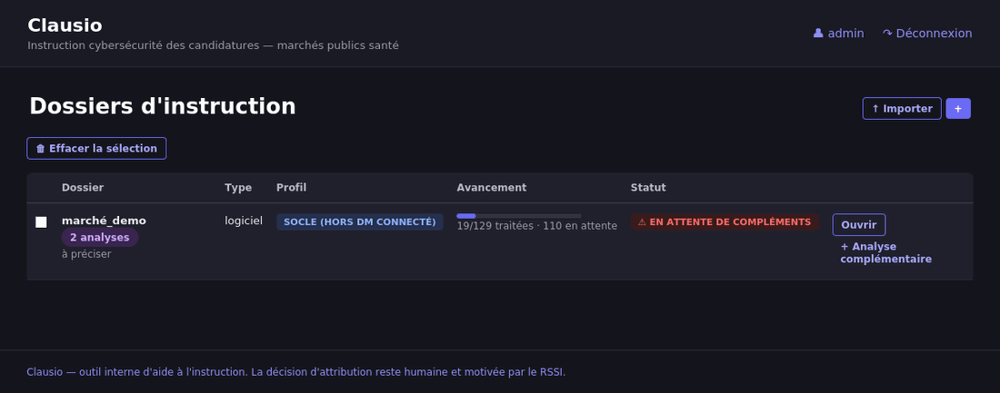
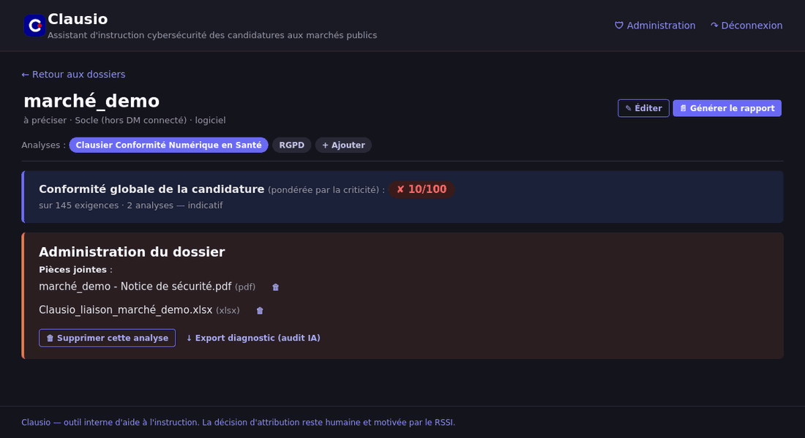
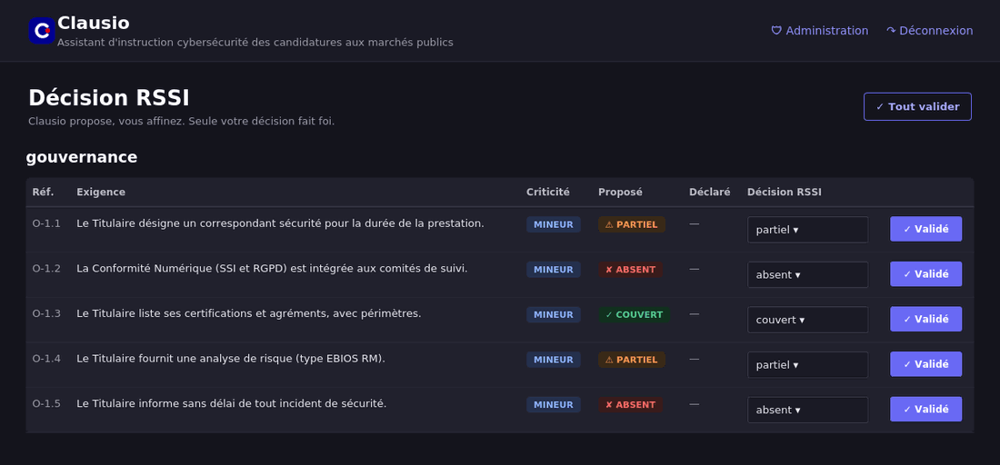
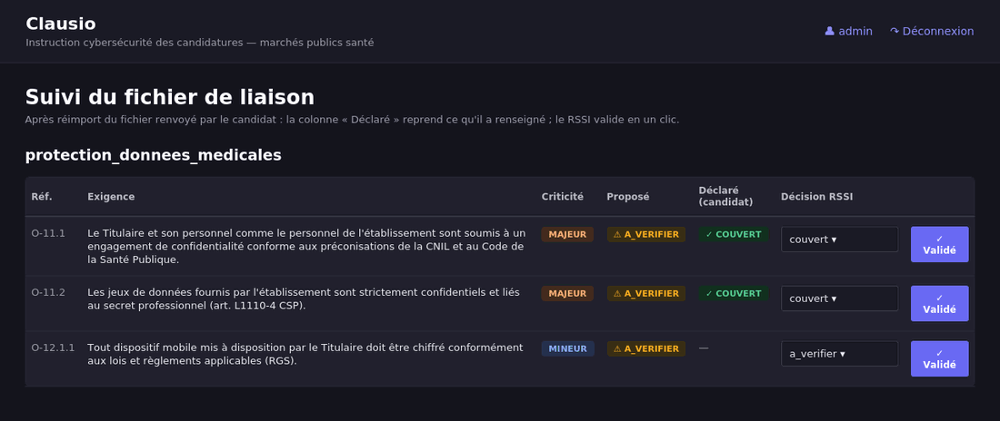
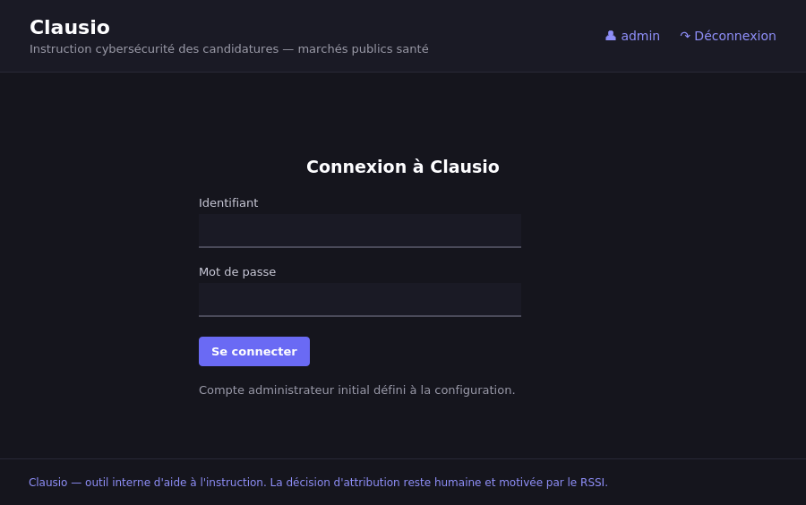

# Clausio

**Assistant d'instruction cybersécurité des candidatures — marchés publics (santé).**

Clausio aide un·e RSSI à instruire le volet cybersécurité des candidatures reçues dans le
cadre d'un marché public : on dépose les documents du candidat, un LLM **pré-qualifie** chaque
exigence d'un référentiel, le·la RSSI **valide ou corrige**, puis Clausio génère un **rapport PDF**
et un **fichier Excel de liaison** à renvoyer au candidat pour compléments.

> **Philosophie : « Clausio propose, le RSSI affine, la décision reste humaine. »**
> Toute sortie du LLM est une *proposition* ; rien n'est décidé automatiquement.

Clausio a été construit **autour des référentiels en vigueur** — RGPD, NIS2, CRA, MDR, IVDR — et,
au cœur du dispositif, autour du **Clausier Conformité Numérique en Santé** élaboré par la
communauté des RSSI de santé (Club RSSI Santé / Club DPO / AFIB). L'objectif est d'outiller le
travail quotidien d'instruction sans jamais s'y substituer.

---

## Fonctionnalités

- Dépôt de documents (PDF, Word, Excel, ZIP) et extraction du texte.
- Pré-qualification par LLM de chaque exigence : `couvert` / `partiel` / `absent` /
  `non_applicable` / `à vérifier`, avec justification et passages cités.
- Recherche **hybride** (sémantique par embeddings ∪ lexicale bilingue FR↔EN) pour retrouver
  les passages pertinents, même quand le candidat reformule ou répond en anglais.
- Validation RSSI par exigence (ou en masse), avec traçabilité.
- **Catalogue de référentiels** : Clausier Conformité Numérique en Santé, NIS2, CRA, MDR, IVDR,
  RGPD — extensible par simple ajout d'un fichier YAML.
- **Analyses liées** : instruire une même candidature sous plusieurs référentiels (onglets),
  avec indicateur de conformité agrégé.
- **Multi-utilisateurs cloisonné** : chaque dossier n'est visible que par son propriétaire (RSSI)
  et le correspondant d'établissement désigné ; l'admin gère les comptes.
- Génération d'un **rapport PDF** et d'un **fichier Excel de liaison** (réimportable).
- **Export de diagnostic** (admin) pour auditer les décisions du LLM.

---

## Aperçu

Le tableau de bord regroupe les candidatures ; une candidature peut être instruite sous plusieurs
référentiels (onglets).



Sur un dossier : navigation entre les analyses, indicateur de conformité globale agrégé, et bloc
d'administration (pièces jointes, suppression, export diagnostic).



Le cœur de l'outil : Clausio *propose* un statut par exigence (avec justification), le RSSI *affine*
et valide. Seule la décision du RSSI fait foi.



Après renvoi du fichier de liaison par le candidat, la colonne « Déclaré » reprend ce qu'il a
renseigné ; la validation se fait en un clic.



Connexion (comptes cloisonnés, gérés par l'administrateur).



> Captures réalisées sur un jeu d'exemple anonymisé (« marché_demo »).

---

## Prérequis

- **Python 3.10+**
- Un accès à un **LLM compatible OpenAI** (Albert, OpenAI, Mistral… ou un LLM **local** :
  Ollama, vLLM, LM Studio). Sans LLM, l'application fonctionne mais tout reste « à vérifier ».

---

## Installation rapide

```bash
git clone <votre-depot> clausio && cd clausio
cp .env.example .env        # puis éditez .env (voir « Configuration du LLM »)
bash run.sh                 # Linux/macOS  (Windows : run.bat)
```

`run.sh` crée l'environnement virtuel, installe les dépendances et démarre le serveur sur
`http://127.0.0.1:3000`. Identifiants initiaux : **admin / clausio2026!** (à changer).

> **Ubuntu / venv** : si la création de l'environnement échoue, installez le paquet
> `python3.X-venv` correspondant à votre version (ex. `sudo apt install -y python3.12-venv`),
> puis relancez `bash run.sh` **sans sudo**. `run.sh` choisit automatiquement la plus récente
> version de Python ≥ 3.10 disponible.

---

## Configuration du LLM

Clausio parle le **protocole OpenAI** (`/chat/completions`, `/embeddings`). Il fonctionne donc
avec n'importe quel fournisseur compatible. La configuration se fait via le fichier `.env`
(copié depuis `.env.example`) ou des variables d'environnement.

| Variable                   | Rôle                                              |
|----------------------------|---------------------------------------------------|
| `CLAUSIO_LLM_BASE_URL`     | URL de base incluant `/v1`                        |
| `CLAUSIO_LLM_API_KEY`      | Clé d'API (vide pour un LLM local)                |
| `CLAUSIO_LLM_MODEL`        | Modèle de génération (vide = auto-détection)      |
| `CLAUSIO_LLM_EMBED_MODEL`  | Modèle d'embeddings (vide = auto-détection)       |

**Exemples** (voir `.env.example` pour le détail) :

- **Albert (DINUM)** : `CLAUSIO_LLM_BASE_URL=https://albert.api.etalab.gouv.fr/v1` + votre clé.
- **OpenAI** : `https://api.openai.com/v1`, modèle `gpt-4o-mini`, embeddings `text-embedding-3-small`.
- **Mistral** : `https://api.mistral.ai/v1`, modèle `mistral-small-latest`, embeddings `mistral-embed`.
- **Ollama (local, sans clé)** :
  `CLAUSIO_LLM_BASE_URL=http://localhost:11434/v1`, `CLAUSIO_LLM_MODEL=llama3.1`,
  `CLAUSIO_LLM_EMBED_MODEL=nomic-embed-text` (après `ollama pull llama3.1` et
  `ollama pull nomic-embed-text`).
- **vLLM / LM Studio / llama.cpp** : pointez `CLAUSIO_LLM_BASE_URL` vers le serveur local.

> La **qualité de la recherche sémantique** dépend de la disponibilité d'un modèle d'embeddings
> (idéalement multilingue). Sans embeddings, Clausio se replie sur une recherche lexicale
> bilingue FR↔EN, moins fine mais fonctionnelle.

---

## Comptes et cloisonnement

- **Administration → Comptes** (admin) : créer des comptes, réinitialiser les mots de passe,
  activer/désactiver. Chaque utilisateur change son propre mot de passe.
- Un dossier n'est visible que par son **propriétaire** (le compte qui l'a créé) et le
  **correspondant d'établissement** désigné (liaison éditeur ↔ RSSI). L'admin voit tout.
- Un compte admin actif est **garanti** au démarrage (le compte `CLAUSIO_USER` est recréé/promu
  si aucun admin n'existe) : pas de verrouillage possible.

---

## Catalogue de référentiels

Le menu « Nouvelle analyse » propose plusieurs référentiels, regroupés par famille. Ajouter un
référentiel = déposer un fichier YAML dans `referentiels/` (il apparaît au redémarrage).

Fournis par défaut : **Clausier Conformité Numérique en Santé**, **NIS2**, **CRA**, **MDR**,
**IVDR**, **RGPD**.

> ⚠️ Les référentiels NIS2, CRA, MDR, IVDR et RGPD sont des **extraits opérationnels** destinés
> à outiller l'instruction. Ils ne sont **pas exhaustifs** et ne se substituent pas à l'analyse
> de conformité réglementaire : à valider/compléter avec le juridique, le DPO et, pour les
> dispositifs médicaux, l'ingénierie biomédicale.

---

## Analyses liées & export de diagnostic

- **Analyse complémentaire** (bouton au tableau de bord) : instruire la même candidature sous un
  autre référentiel (RGPD pour la DPO, MDR pour le biomed…). Les analyses deviennent des onglets
  d'un même dossier ; on peut aussi **rattacher** une analyse déjà réalisée séparément.
- **Export de diagnostic** (admin, sur la page d'un dossier) : pour chaque exigence, le statut
  proposé, la confiance, la justification du LLM et les passages qui lui ont été soumis. Utile
  pour comprendre les « à vérifier ».

---

## Déploiement (VPS, accès distant)

`run.sh` écoute par défaut sur `0.0.0.0:3000`. Pour une mise en ligne propre : service **systemd**
+ reverse-proxy **Caddy** (HTTPS automatique). Fichiers et procédure dans **`deploy/`**
(`clausio.service`, `Caddyfile`, `README-deploiement.md`).

Pare-feu (Ubuntu) : n'ouvrez que ce qui est nécessaire.
```bash
sudo ufw allow OpenSSH
sudo ufw allow 80,443/tcp     # si Caddy en frontal
sudo ufw enable
```

---

## Sécurité & limites — à lire

- **Non-décision** : Clausio *propose*. La qualification finale et l'avis relèvent du·de la RSSI.
- **Données sensibles** : un VPS ou un poste ordinaire n'est **pas un hébergement conforme**
  (HDS / SecNumCloud). N'y déposez pas de vraies candidatures ni de données de santé — réservez
  ces instances à la démonstration, l'ergonomie et des dossiers non sensibles.
- **Avant toute mise en ligne** : changez `CLAUSIO_USER` / `CLAUSIO_PASSWORD`, définissez un
  `CLAUSIO_SESSION_SECRET` unique, et placez l'application derrière HTTPS.
- **Authentification** : le module de comptes intégré convient à un usage restreint ; pour un
  déploiement d'établissement, envisagez un rattachement au SSO/LDAP.

---

## Structure du projet

```
app/            # application FastAPI (config, modèles, LLM, analyse, rapports, routes)
referentiels/   # référentiels YAML (clausier santé, NIS2, CRA, MDR, IVDR, RGPD)
templates/      # gabarits Jinja2 (interface DSFR)
deploy/         # service systemd, Caddyfile, guide de déploiement
.env.example    # modèle de configuration
run.sh / run.bat
```

---

## Contribution

Les contributions sont bienvenues (issues, correctifs, nouveaux référentiels). Merci de garder la
**documentation en français** et de respecter la philosophie de non-décision automatique.

## Remerciements

Clausio s'appuie sur le travail de la **communauté des RSSI de santé**, et en particulier sur le
**Clausier Conformité Numérique en Santé** (Club RSSI Santé / Club DPO / AFIB), ainsi que sur les
référentiels réglementaires en vigueur (RGPD, NIS2, CRA, MDR, IVDR).

Merci à la communauté des RSSI de santé pour son **combat permanent à rendre nos hôpitaux plus
sûrs**. Cet outil leur est dédié, dans l'espoir de leur faire gagner un peu de temps sur
l'instruction, pour qu'ils puissent en consacrer davantage à l'essentiel : la protection des
patients et de leurs données.

## Licence

Distribué sous licence **MIT** (voir `LICENSE`). Adaptez-la à votre contexte si besoin — la
licence **EUPL-1.2** est une alternative courante dans le secteur public.

---

*Clausio est un outil d'aide à l'instruction. Il ne remplace ni l'analyse humaine, ni un avis
juridique, ni une analyse de conformité réglementaire.*
